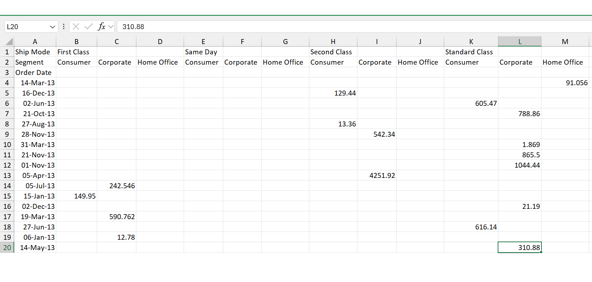
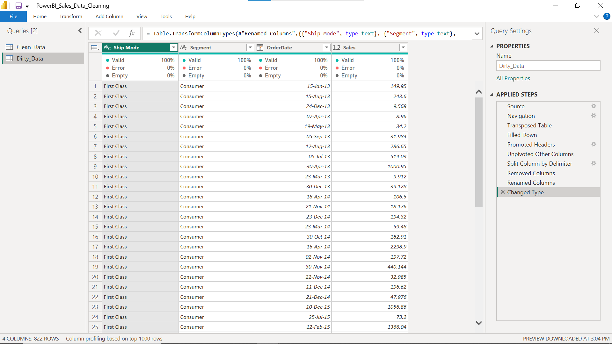
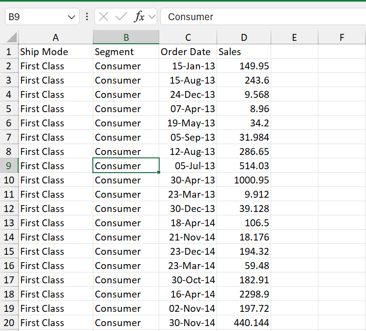

# Power BI Data Cleaning Challenge

Transforming messy Excel data into a clean, analysis-ready dataset using Power Query in Power BI.

---

## 🔴 1. Raw Dataset (Before Cleaning)

The original dataset had:
- Merged headers
- Inconsistent formatting
- Unstructured layout
- Difficult analysis structure

---

## 🟡 2. Data Transformation (Power Query)

Key transformations performed:
- Fill Down
- Split Columns
- Unpivot Data
- Change Data Types
- Remove Duplicates
- Clean structure for analysis

---

## 🟢 3. Clean Dataset (After Cleaning)

Final output:
- Structured dataset
- Analysis-ready format
- Suitable for dashboards and reporting

---

## 🛠 Tools Used
- Microsoft Excel
- Power BI
- Power Query

---

## 📊 Project Outcome
This project demonstrates how raw messy data can be transformed into meaningful insights-ready data using Power BI.
